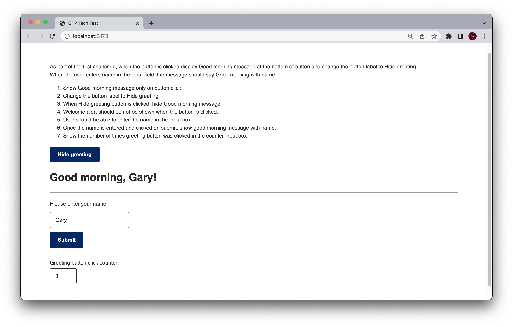

# GTP Interview - Tech Test

A tech-test that was completed as part of the interview with the Government Technlogy Platforms (GTP) team. Built using React Typescript. The basic code and styling was provided by the interviewer, but has been cleaned up using NSW.digital styling.



## MVP

The final app should do the following:

- [x] Show Good morning message only on button click.
- [x] Change the button label to Hide greeting
- [x] When Hide greeting button is clicked, hide Good morning message
- [x] Welcome alert should be not be shown when the button is clicked.
- [x] User should be able to enter the name in the input box
- [x] Once the name is entered and clicked on submit, show good morning message with name.
- [x] Show the number of times greeting button was clicked in the counter input box

## Challenges

- As I am new to typescript, I was initially a bit unsure about how to type the function callbacks, but once I got past this initial challenge, the remaining were relatively easier to solve.

## Reflection/Learning

- I need to spend more time to learn typescript, but I am getting the hang of it.
- Disregarding the typescript aspect of the challenge, I feel more confident in my abilities with React, as I was able to get through the rest of the challenge relatively quickly.

## Compiling and running the app

Start by cloning the repo to your local device

Once your have changed directories into the "gtp-tech-test" folder in your Terminal, make sure to install the dependencies before running the app.

```
cd gtp-tech-test
npm install
npm run dev
```

## Useful resources

- [React Typescript Cheatsheet](https://react-typescript-cheatsheet.netlify.app/docs/basic/getting-started/forms_and_events/)

---

### Reachout

- [LinkedIn](https://au.linkedin.com/in/ayushjames)
- [Email](mailto:ayushpjames@gmail.com)
